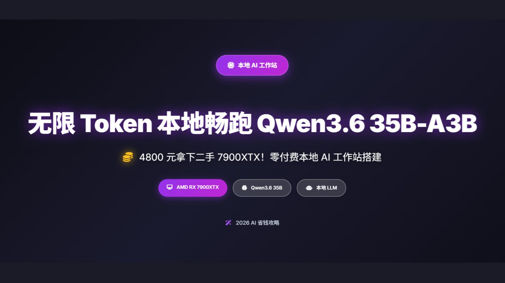
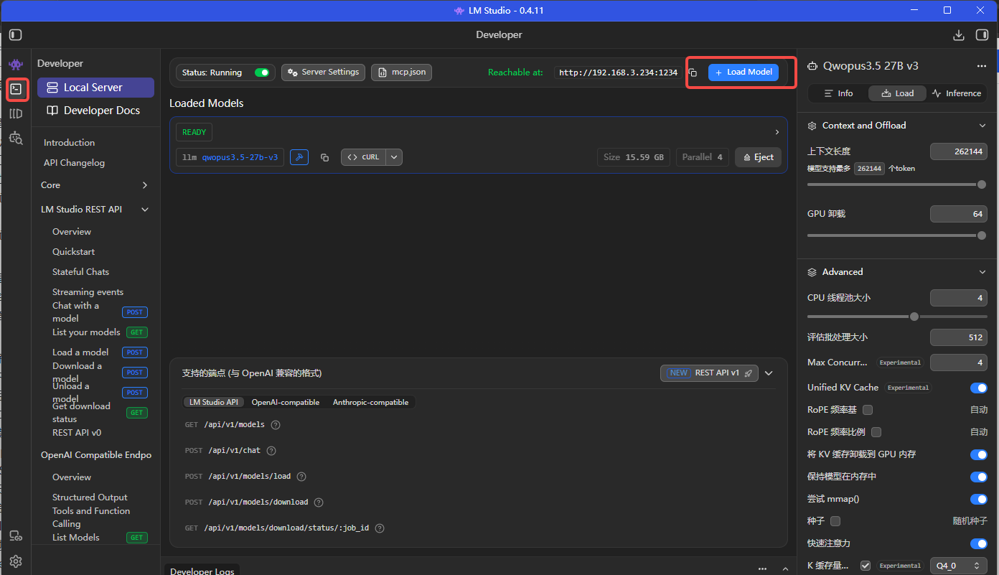
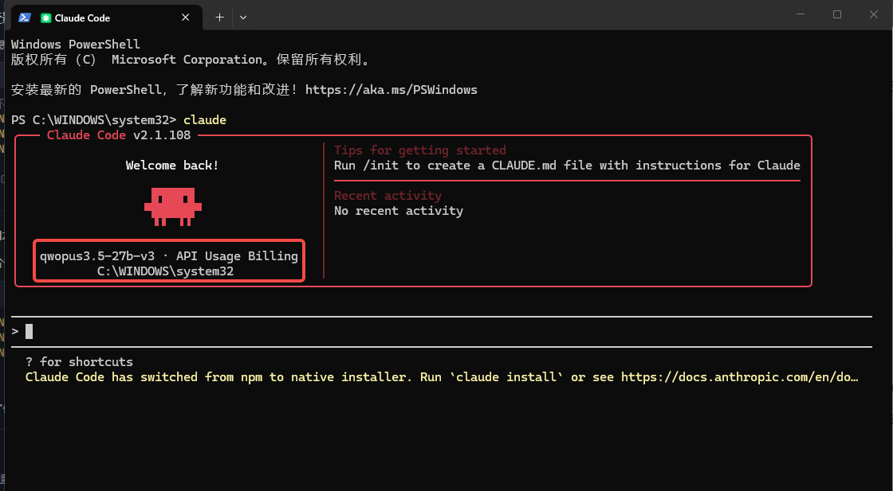
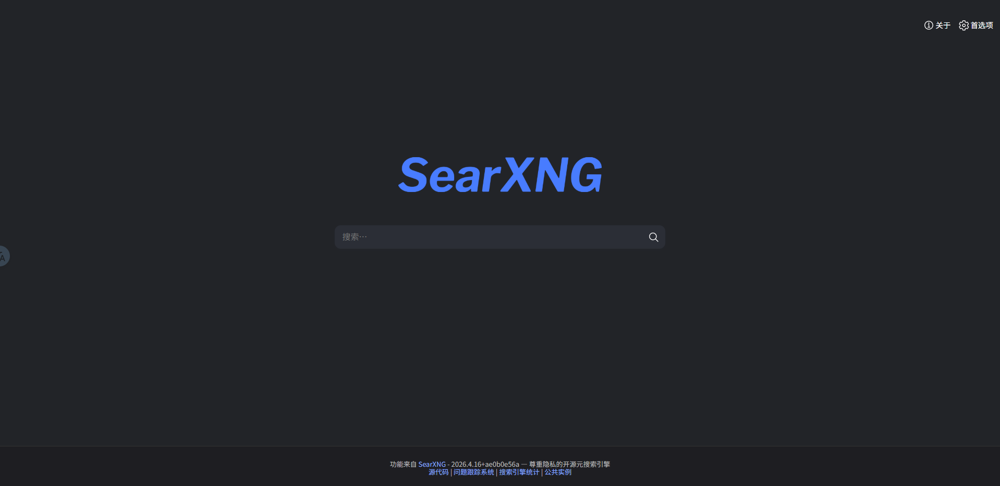

# 🧠 个人AI中枢搭建 - 基础设施

本文档介绍如何搭建个人 AI 中枢系统。



***

## 📋 目录

- [第一步：装机+系统安装](#第一步装机系统安装小白首选windows11)
- [第二步：部署AI大脑](#第二步部署ai大脑lm-studiogemma4模型)
- [第三步：安装OpenClaw调度中枢](#第三步安装openclaw调度中枢)
- [第四步：安装专项工具](#第四步安装专项工具-claude-codesearxng)

***

## 🚀 第一步：装机+系统安装（小白首选Windows11）

别盲目跟风Linux-直接装window-安装方式省事就直接问豆包（并安装对应的显卡驱动）

> ⚠️ **驱动建议**：驱动版本 `25.20.01.17`
>
> - 下载地址：<https://www.amd.com/en/resources/support-articles/release-notes/RN-AMDGPU-WINDOWS-PYTORCH-7-1-1.html>

***

## 🖥️ 第二步：部署AI大脑（LM Studio+Gemma4模型）



### 📦 1、LM Studio 安装

下载地址：<https://lmstudio.ai/download>

按照自己的系统选择安装即可。

### 🤖 2、模型下载

安装下载好的 LM Studio，点击可以搜索 Hugging Face 上已经开源的模型。

> 💡 软件会自动识别你目前显卡可以适配的模型

模型下载完成后就可以加载模型（供本地局域网内 Agent 调用）+ 聊天（软件内聊天）

关于模型加载的注意事项后期我会再出一期给大家介绍一下遇到的坑。

### ▶️ 启动服务

此处点击 **Run** 就可以供本地或者局域网内的 OpenClaw 调用了：

> ⚠️ **注意区分**：
>
> - 局域网内使用：`http://192.168.3.234:1234`（需要开启在网络中提供服务、启用 CORS）
> - 本地使用：`http://127.0.0.1:1234`

***

## 🔗 第三步：安装OpenClaw调度中枢

官网地址：<https://openclaw.ai/>

可以使用官方 shell 命令安装，也可以使用 npm 安装。

> ⚠️ 使用 npm 安装本地一定要先安装 node.js 环境：<https://nodejs.org/en/download>

小白可以直接使用 shell 命令安装：

```powershell
powershell -c "irm https://openclaw.ai/install.ps1 | iex"
```

会自动检测环境。

> 💡 备注：如果没有后台启动可以执行：`openclaw gateway run`

下载完成后就进入初始化流程，在模型配置时候一定要选择，并配置你本地模型地址、模型id。

***

## 🛠️ 第四步：安装专项工具（Claude Code+SearXNG）

***

### 1️⃣ 安装 Claude Code



#### （1）在 Windows 上使用 PowerShell（管理员权限）：

```powershell
npm install -g @anthropic-ai/claude-code
```

#### （2）验证安装：

```bash
claude --version
```

输出版本号就证明成功了 ✅

#### （3）关键：配置本地模型 ⭐

要让 Claude Code 使用本地模型，你需要配置以下环境变量：

| 环境变量                   | 说明        | 示例值                                                   |
| ---------------------- | --------- | ----------------------------------------------------- |
| `ANTHROPIC_BASE_URL`   | 本地 API 端点 | `http://127.0.0.1:1234` 或 `http://192.168.3.234:1234` |
| `ANTHROPIC_MODEL`      | 模型名称      | 你下载的模型名称，如：`qwen2.5-coder:7b`                         |
| `ANTHROPIC_AUTH_TOKEN` | 认证令牌（可选）  | 任意值或 `dummy`                                          |

**配置方式（可以使用 PowerShell 命令）如下：**

```powershell
$env:ANTHROPIC_BASE_URL="http://127.0.0.1:1234"
$env:ANTHROPIC_MODEL="qwen2.5-coder:7b"
$env:ANTHROPIC_AUTH_TOKEN="dummy"
```

或者搜索编辑系统环境变量 - 环境变量 - 用户变量点击新建后保存即可。

#### （4）运行 Claude Code：

PowerShell 运行 `claude`，出现如下界面及可正常使用：

> ⚠️ **重要**：安装 Claude Code 一定要确保 node.js 环境、git 环境已经准备
>
> - git 下载地址：<https://git-scm.com/install/windows>
> - 安装完成后 PowerShell 运行：`git --version`，输出版本号即安装成功 ✅

***

### 2️⃣ 安装 SearXNG



官方文档：<https://docs.searxng.org/>

> 💡 推荐使用 Docker 安装。

#### （1）安装 Docker

官方地址：<https://www.docker.com/products/docker-desktop/>

（直接下载安装包，点击安装即可）

#### （2）拉取 SearXNG 镜像

```bash
docker pull searxng/searxng
```

> 💡 如果由于网络限制拉取不到镜像，可以自行构建服务可参考官方文档

#### （3）启动服务

```bash
docker run -d -p 8080:8080 searxng/searxng
```

访问：<http://localhost:8080/>

> ⚠️ 注意要在右上角设置搜索源要是 baidu、sougou 等国内源，要不然国外的可能出现网络问题

#### （4）配置 OpenClaw\.json

参考：<https://docs.openclaw.ai/zh-CN/tools/searxng-search>

***

#### 🔧 数据持久化配置（可选但推荐）

验证可用后就进入最关键一步：挂载本地宿主机实现数据持久化。

**1.** 停止服务并删除容器：

```bash
docker stop searxng && docker rm searxng
```

**2.** 在本机系统创建 docker 容器的挂载配置及数据持久化保存位置：

```bash
mkdir -p D:\docker\searxng\config
```

**3.** 复制容器的配置文件到挂载目录：

```bash
docker cp searxng_temp:/etc/searxng/settings.yml D:\docker\searxng\config\
```

**4.** 停止并删除临时容器：

```bash
docker stop searxng_temp
docker rm searxng_temp
```

**5.** 修改配置文件（持久化）：

用编辑器打开 `D:\docker\searxng\config\settings.yml`，请修改文件，做以下 **3 处修改**：

- ✅ 在 `search` 节点下的 `formats` 数组中添加 `json`（允许格式：html 和 json）
- ✅ 在 `server` 节点下将 `bind_address` 从 `127.0.0.1` 改为 `0.0.0.0` 以允许外部访问
- ✅ 找到所有 `disabled: true` 和 `inactive: true` 的搜索引擎配置，将它们全部改为 `false` 以启用这些搜索引擎（包括百度、搜狗等国内搜索引擎）

**6.** 正式运行（挂载配置）：

```bash
docker run -d --name searxng -p 8080:8080 -v D:\docker\searxng\config\settings.yml:/etc/searxng/settings.yml r353jsh7sz9i2iyvw5.xuanyuan.run/searxng/searxng
```

即可在浏览器中访问了：<http://localhost:8888> 可搜索内容；

**需要 JSON 返回内容（OpenClaw/Agent 调用）：**

```
http://localhost:8080/search?q=搜索内容&format=json
```

***

> 💡 **重点**：如果你觉得太复杂，完全可以用你刚部署的 Claude Code 或者用 Trae 这类 AI CLI 工具帮你完成，你只需要给他准备好 docker 环境、保证网络畅通。

***

## 📥 软件下载

本期涉及到需要下载的软件，存储在云盘，需要可以自取

***

## 📌 快速命令汇总

| 操作             | 命令                                           |
| -------------- | -------------------------------------------- |
| 安装 Claude Code | `npm install -g @anthropic-ai/claude-code`   |
| 启动 OpenClaw    | `openclaw gateway run`                       |
| 拉取 SearXNG     | `docker pull searxng/searxng`                |
| 启动 SearXNG     | `docker run -d -p 8080:8080 searxng/searxng` |
| 验证 Git         | `git --version`                              |

***

*祝你搭建成功！🎉*
